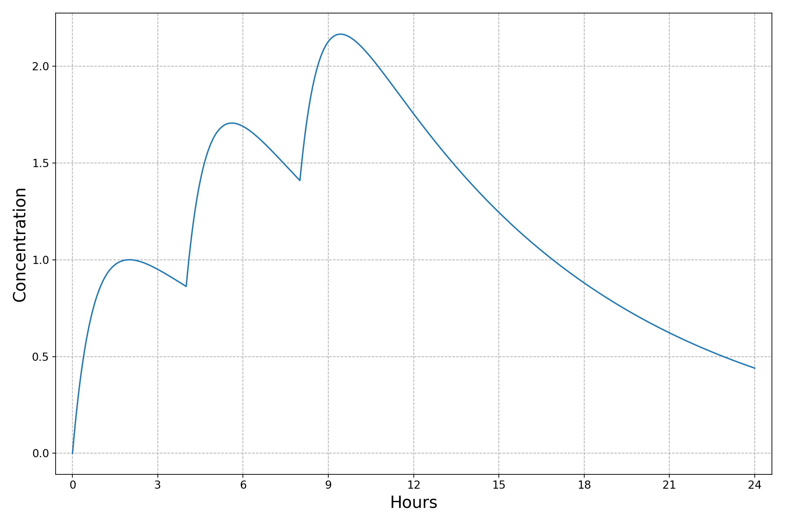

pharmacokinetics
================

Calculates and plots drug concentration over time.

Example output
--------------

Here, `pk` computes the concentration of a drug with a terminal half-life (t<sub>1/2</sub>) of 6 hours and a time to maximum concentration (t<sub>max</sub>) of 2 hours. Doses of 1 unit each were given at t+0, t+4, and t+8 hours.

```bash
pk --hl 6 --tmax 2 --doses 1 1 1 --offsets 0 4 8 --output demo.png
```



Installation
------------

```bash
python3 setup.py install
```

Usage
-----

```
usage: pk [-h] --hl HOURS --tmax HOURS [--time HOURS]
          [--doses DOSE [DOSE ...]] [--offsets OFFSET [OFFSET ...]]
          [--output OUTPUT]

Calculates and plots drug concentration over time.

optional arguments:
  -h, --help            show this help message and exit
  --hl HOURS            the drug's terminal half-life, in hours
  --tmax HOURS          the drug's time to maximum concentration, in hours
  --time HOURS          the number of hours to simulate concentrations for
  --doses DOSE [DOSE ...]
                        the magnitudes of each dose
  --offsets OFFSET [OFFSET ...]
                        the time, in hours, each dose is given at
  --output OUTPUT       the output image file
```
