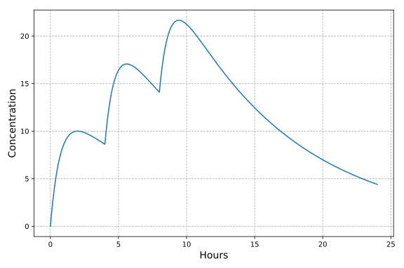

pharmacokinetics
================

A Flask web application to calculate and plot drug concentration over time. A standalone CLI interface is also included.

Example output
--------------

Here, `pk` computes the concentration of a drug with a terminal half-life (t<sub>½</sub>) of 6 hours and a time to maximum concentration (t<sub>max</sub>) of 2 hours. Doses of 10 mg each were given at t+0, t+4, and t+8 hours.



Installation
------------

First, clone this repository:

```bash
git clone https://github.com/crowsonkb/pharmacokinetics
cd pharmacokinetics
```

Create a new Python 3 virtual environment and activate it:

```bash
python3 -m venv venv
source venv/bin/activate
```

Install the package and its dependencies:

```bash
python3 setup.py install
```

This also installs the `pk` command line interface.

Run the web application:

```bash
flask run
```

This will start a development server on port 5000.

CLI Usage
---------

```
usage: pk [-h] --hl HOURS --tmax HOURS [--duration HOURS]
          [--doses DOSE [DOSE ...]] [--offsets OFFSET [OFFSET ...]]
          [--output FILE] [--output-size W H] [--dpi DPI]

Calculates and plots drug concentration over time.

optional arguments:
  -h, --help            show this help message and exit
  --hl HOURS            the drug's elimination half-life, in hours (default:
                        None)
  --tmax HOURS          the drug's time to maximum concentration, in hours
                        (default: None)
  --duration HOURS      the duration, in hours, to simulate concentrations for
                        (default: 24)
  --doses DOSE [DOSE ...]
                        the magnitudes of each dose (units are arbitrary)
                        (default: [1])
  --offsets OFFSET [OFFSET ...]
                        the time, in hours, that each dose is given at
                        (default: [0])
  --output FILE         the output image filename (default: output.png)
  --output-size W H     the output width and height in pixels (default: [1920,
                        1280])
  --dpi DPI             the output dots per inch (dpi) (default: 160)
```
